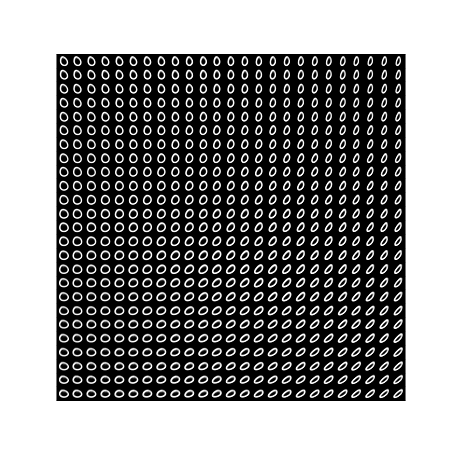
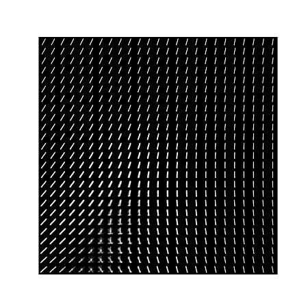
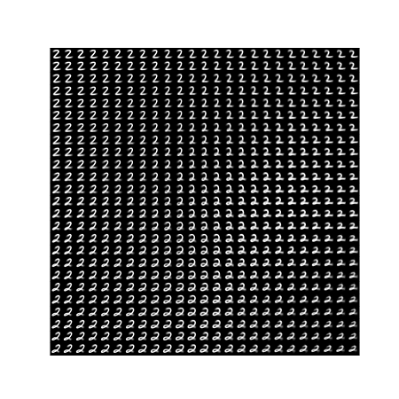
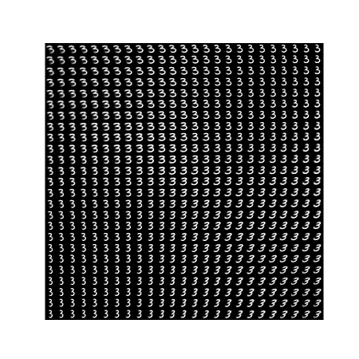
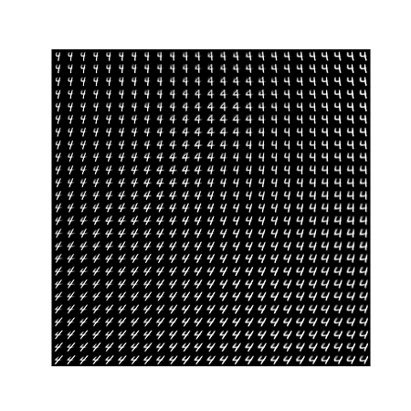
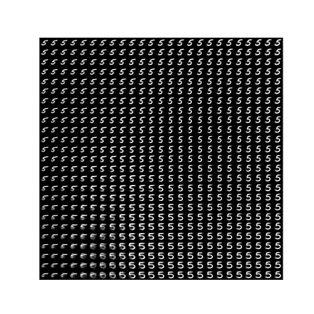
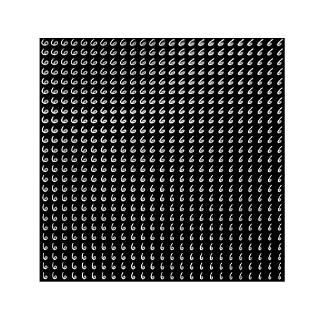
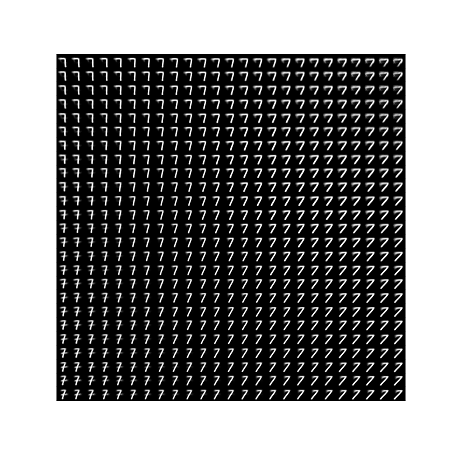
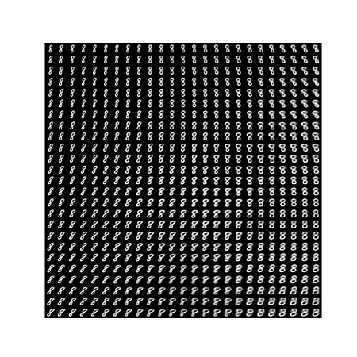
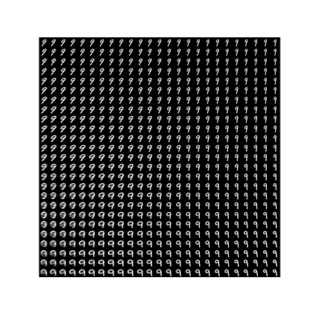

#  VAE mnist2   

This draws lattice point images of each digit number by VAE method using MNIST dataset.   
This is cloned from [VAE](https://github.com/beginaid/VAE) and changed.  

## usage  

specify one of digit number as argument.  
```
python main.py --digit-number [0-9]  
```

## lattice point images   

These are lattice point images of which range is -2 to 2.      


  
  
  
  
  
  
  
  
  
  


## License  

Regarding to original license, please see LICENSE-VAE-main.txt and LICENSE-torchvision.    


